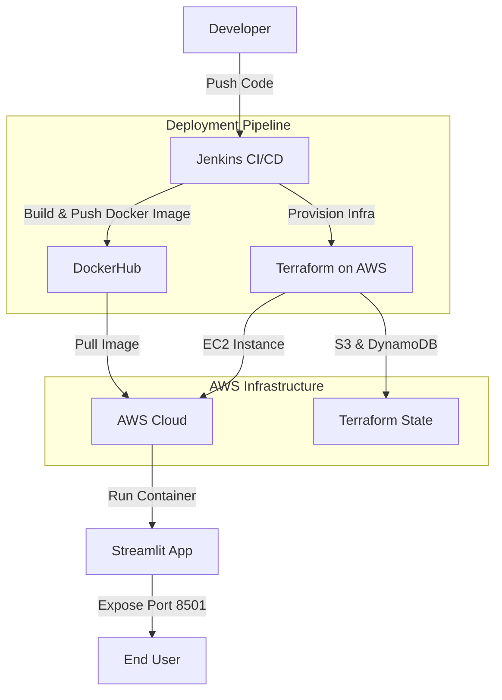

# 🚀 Walmart Sales Prediction - regression-DevOpsified


> **A modern, end-to-end MLOps pipeline for Walmart sales prediction with complete DevOps automation, cloud-native deployment, and monitoring.**

---

## 📚 Table of Contents
- [Overview](#overview)
- [Features](#features)
- [Project Structure](#project-structure)
- [DevOps & Cloud Infrastructure](#devops--cloud-infrastructure)
- [Cloud Architecture](#cloud-architecture)
- [Installation](#installation)
- [Usage](#usage)
- [Contributing](#contributing)
- [License](#license)

---

## 📝 Overview
This repository implements an end-to-end MLOps solution for a Walmart sales prediction model. It integrates ML model development with modern DevOps practices including CI/CD, infrastructure-as-code, containerization, orchestration, and cloud deployment. The workflow is designed for **reproducibility, scalability, automation, and monitoring** using industry-standard tools.

---

## ✨ Features
- 🔄 **Automated CI/CD** with Jenkins
- 🐳 **Containerized** ML app with Docker and deployment on AWS EC2
- ☸️ **Kubernetes** deployment manifests for scalable orchestration
- ☁️ **Cloud-native** infrastructure on AWS (EC2, S3, DynamoDB)
- 🏗️ **Infrastructure as Code** with Terraform
- 📈 **Monitoring-ready** (Prometheus integration planned)
- 📊 Streamlit-based interactive sales prediction dashboard
- 🧪 Complete deployment pipeline

---

## 🗂️ Project Structure
```text
regression-DevOpsified/
├── ml-model/              # Machine learning model code
│   ├── main.py            # Streamlit app for model interaction
│   ├── requirements.txt   # Python dependencies for the ML model
│   └── Walmart_Sales.csv  # Dataset for training
├── k8s/                   # Kubernetes manifests
│   ├── deployment.yml     # K8s deployment configuration
│   └── service.yml        # K8s service configuration
├── terraform/             # Infrastructure as Code (AWS)
│   ├── bootstrap/         # Remote state setup
│   │   └── remote-state.tf# S3 and DynamoDB for state management
│   └── infrastructure/    # Main infrastructure configuration
│       ├── main.tf        # EC2, security groups, etc.
│       ├── output.tf      # Output values
│       ├── provider.tf    # AWS provider configuration
│       ├── terraform.tf   # Terraform backend configuration
│       └── variable.tf    # Variable definitions
├── Dockerfile             # Container definition for ML app
├── Jenkinsfile            # CI/CD pipeline definition
└── README.md              # Project documentation
```

---

## 📊 DevOps & Cloud Infrastructure

This project implements a comprehensive DevOps pipeline for ML model deployment with the following components:

### 🐳 Docker
- **Role:** Packages the Streamlit ML app and all dependencies into a portable container image.
- **Implementation:**
  - Uses Python 3.10 slim base image for minimal footprint
  - Installs required build dependencies and Python packages
  - Configures Streamlit to run on port 8501, accessible externally
  - Optimized for AMD64 platform compatibility with AWS EC2
  - Images are stored on DockerHub repository (`trahulprabhu38/mlops:v1`)
  
  ```bash
  docker buildx build --platform linux/amd64 -t trahulprabhu38/mlops:v1 .
  docker push trahulprabhu38/mlops:v1
  ```

### 🛠️ Jenkins CI/CD Pipeline
- **Role:** Orchestrates the entire deployment process from code to cloud infrastructure.
- **Pipeline Stages:**
  1. **Checkout**: Retrieves code from source control
  2. **Setup SSH Keys**: Securely configures SSH access to AWS infrastructure
  3. **Bootstrap Terraform**: Initializes S3 backend and DynamoDB for state management
  4. **Infrastructure Terraform Init/Validate/Plan**: Prepares infrastructure deployment
  5. **Approval**: Manual gate for infrastructure changes
  6. **Infrastructure Terraform Apply**: Deploys AWS resources
  7. **Capture Output**: Records deployment details (EC2 public IP) for access
  
- **Security Features:**
  - Credential management for AWS and SSH keys
  - Workspace cleanup of sensitive data
  - Manual approval gate for infrastructure changes


### 🏗️ Terraform Infrastructure
- **Role:** Provides Infrastructure as Code (IaC) for consistent, repeatable deployments
- **Components:**
  1. **Remote State Management** (`terraform/bootstrap/`)
     - S3 bucket (`mlops-terraform-state-bucket-remote`) for state storage
     - DynamoDB table (`terraform-lock-table`) for state locking
  
  2. **Core Infrastructure** (`terraform/infrastructure/`)
     - **AWS EC2 Instance:** Hosts Streamlit application
     - **Security Groups:** Controls access to ports 8501 (Streamlit) and 22 (SSH)
     - **SSH Key Pair:** Manages secure access to the instance
     - **User Data:** Bootstraps Docker and deploys container automatically
     - **Output Variables:** Provides access information for deployed services

- **State Management:**
  - Remote state stored in S3 with encryption
  - Locking via DynamoDB to prevent concurrent modifications

### ☸️ Kubernetes
- **Role:** Provides container orchestration for scalability and resilience
- **Implementation:**
  - Deployment manifests in `k8s/deployment.yml`
  - Service exposure in `k8s/service.yml`
  - Compatible with both cloud (EKS) and local (Minikube) environments

### 📈 Monitoring (Planned)
- Prometheus integration for metrics collection
- Dashboard for model performance and infrastructure health

---

## ☁️ Cloud Architecture



---

## 🛠️ Installation
1. **Clone the repository:**
    ```bash
    git clone https://github.com/yourusername/regression-DevOpsified.git
    cd regression-DevOpsified
    ```

2. **Set up prerequisites:**
   - AWS account with appropriate permissions
   - Jenkins server with AWS and Docker plugins
   - Docker account for image hosting
   - Terraform installed locally for development

3. **Configure AWS credentials**
   ```bash
   aws configure
   ```

4. **Set up Jenkins credentials:**
   - AWS credentials with ID 'aws-key'
   - SSH private key with ID 'aws-ssh-key'
   - SSH public key with ID 'aws-ssh-key-pub'

---

## 🚀 Usage
1. **Local development:**
   ```bash
   cd ml-model
   pip install -r requirements.txt
   streamlit run main.py
   ```

2. **Docker deployment:**
   ```bash
   docker build -t mlops:local .
   docker run -p 8501:8501 mlops:local
   ```

3. **Full CI/CD pipeline:**
   - Push code to repository
   - Jenkins will automatically trigger the pipeline
   - Access the deployed app at http://{instance_ip}:8501

4. **Kubernetes deployment:**
   ```bash
   kubectl apply -f k8s/
   ```

---

## 🤝 Contributing
Contributions are welcome! Please open issues or submit pull requests for improvements.

---

## 📄 License
This project is licensed under the MIT License.
