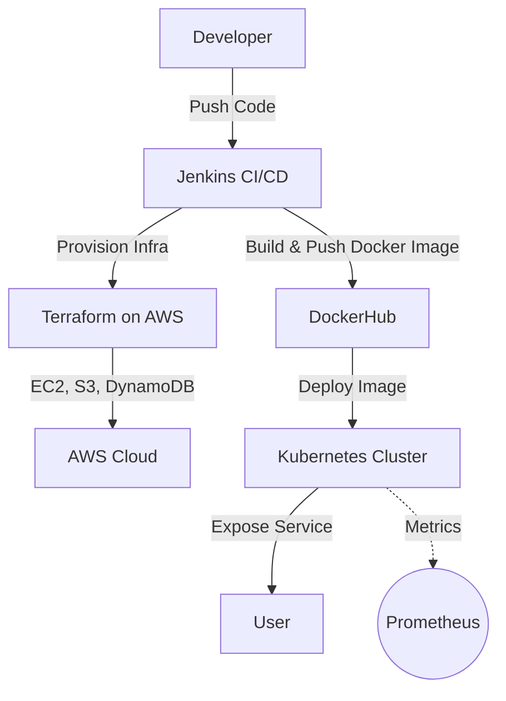

# 🚀 mlOps-project


> **A modern, end-to-end MLOps pipeline with full DevOps automation, cloud-native deployment, and monitoring.**

---

## 📚 Table of Contents
- [Overview](#overview)
- [Features](#features)
- [Project Structure](#project-structure)
- [DevOps & Cloud Tooling](#devops--cloud-tooling)
- [Cloud Architecture](#cloud-architecture)
- [Installation](#installation)
- [Usage](#usage)
- [Contributing](#contributing)
- [License](#license)

---

## 📝 Overview
This repository demonstrates best practices in Machine Learning Operations (MLOps), integrating model development, CI/CD, infrastructure-as-code, containerization, orchestration, and cloud deployment. The workflow is designed for **reproducibility, scalability, automation, and monitoring** using industry-standard DevOps tools.

---

## ✨ Features
- 🔄 **Automated CI/CD** with Jenkins
- 🐳 **Containerized** ML app with Docker
- ☸️ **Kubernetes** deployment manifests for scalable orchestration
- ☁️ **Cloud-native** infrastructure on AWS (EC2, S3, DynamoDB)
- 🏗️ **Infrastructure as Code** with Terraform
- 📈 **Monitoring-ready** (Prometheus integration planned)
- 📦 Model training, evaluation, and REST API serving
- 🧪 Unit and integration tests

---

## 🗂️ Project Structure
```text
mlOps-project/
├── data/               # Raw and processed data
├── notebooks/          # Jupyter notebooks for exploration
├── src/                # Source code for training and serving
├── models/             # Saved models
├── tests/              # Unit and integration tests
├── Dockerfile          # Containerization
├── Jenkinsfile         # CI/CD pipeline
├── k8s/                # Kubernetes manifests
├── terraform/          # Infrastructure as Code (AWS)
├── requirements.txt    # Python dependencies
└── README.md           # Project documentation
```

---

## ⚙️ DevOps & Cloud Tooling

### 🐳 Docker
- **Role:** Packages the ML app and dependencies into a portable container image.
- **How:** See `Dockerfile`. Build and push with:
  ```bash
  docker buildx build --platform linux/amd64 -t <your-dockerhub-username>/mlops:v1 .
  docker push <your-dockerhub-username>/mlops:v1
  ```

### ☸️ Kubernetes
- **Role:** Orchestrates and scales the containerized app.
- **How:** See `k8s/deployment.yml` and `k8s/service.yml` for deployment and service manifests.
- **Usage:**
  ```bash
  kubectl apply -f k8s/
  # For local testing:
  minikube service walmart-sales-service
  ```

### 🛠️ Jenkins
- **Role:** Automates CI/CD, infrastructure provisioning, and deployment.
- **How:** See `Jenkinsfile` for a multi-stage pipeline:
  - Checks out code
  - Sets up SSH keys
  - Bootstraps and applies Terraform (infra provisioning)
  - Builds and deploys Docker image
  - Captures and archives deployment outputs

### 🏗️ Terraform + ☁️ AWS
- **Role:** Provisions and manages AWS infrastructure (EC2, S3, DynamoDB, Security Groups, etc.)
- **How:**
  - `terraform/bootstrap/remote-state.tf`: Sets up S3 bucket and DynamoDB for remote state and locking
  - `terraform/infrastructure/*.tf`: Provisions EC2, security groups, and deploys the Dockerized app
  - **Provider:** AWS (see `provider.tf`)

### 📈 Prometheus *(Planned)*
- **Role:** Monitoring and alerting for deployed services
- **How:** Prometheus integration is planned for future releases to enable metrics scraping and alerting for the ML API and infrastructure.

---

## ☁️ Cloud Architecture


*Replace with your own architecture diagram if needed.*

---

## 🛠️ Installation
1. **Clone the repository:**
    ```bash
    git clone https://github.com/yourusername/mlOps-project.git
    cd mlOps-project
    ```
2. **Create a virtual environment and install dependencies:**
    ```bash
    python3 -m venv venv
    source venv/bin/activate
    pip install -r requirements.txt
    ```

---

## 🚀 Usage
1. **Prepare your data** in the `data/` directory.
2. **Train the model:**
    ```bash
    python src/train.py
    ```
3. **Serve the model as an API:**
    ```bash
    python src/serve.py
    ```
4. **Run tests:**
    ```bash
    pytest tests/
    ```

---

## 🤝 Contributing
Contributions are welcome! Please open issues or submit pull requests for improvements.

---

## 📄 License
This project is licensed under the MIT License.