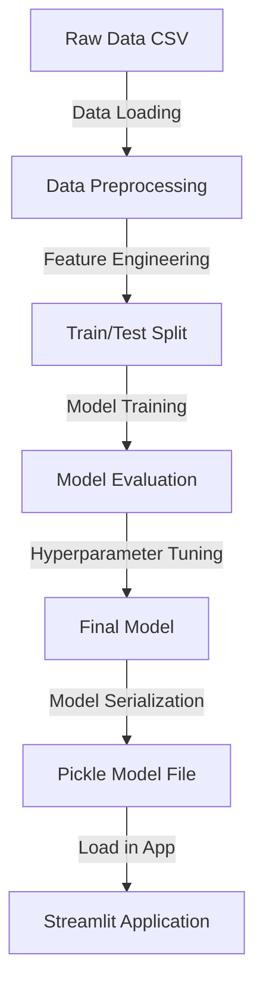
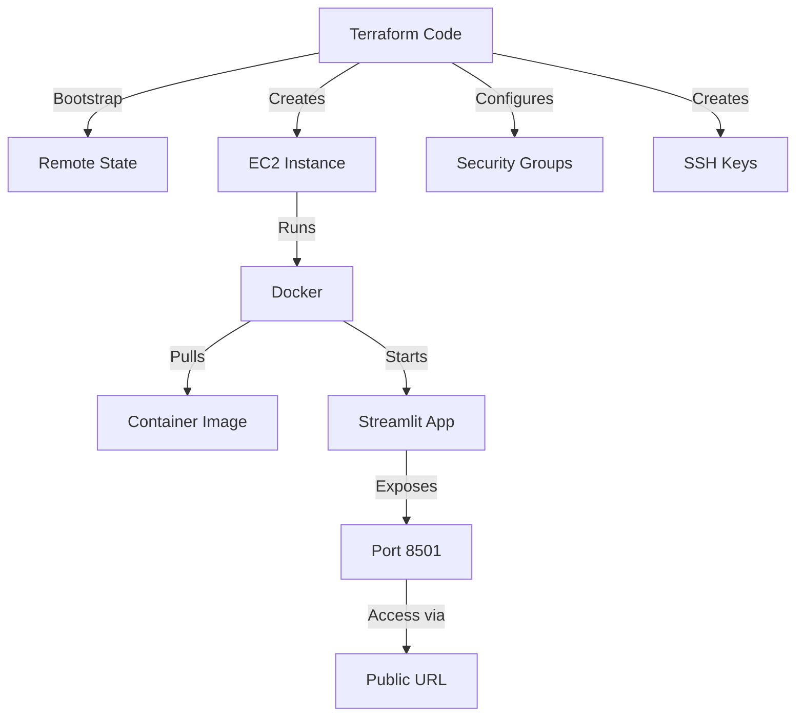
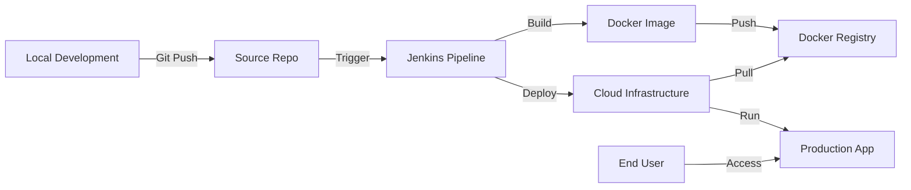
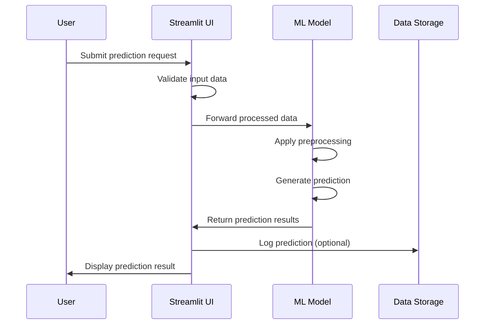

# 🏗️ Project Architecture - Walmart Sales Prediction MLOps

## 🌐 Cloud Architecture & System Design

This document provides a comprehensive explanation of the cloud infrastructure and system design principles implemented in this project.

## Table of Contents
- [High-Level System Design](#high-level-system-design)
- [Low-Level System Design](#low-level-system-design)
- [Cloud Architecture Components](#cloud-architecture-components)
- [Data Flow Architecture](#data-flow-architecture)
- [Security Architecture](#security-architecture)
- [Scaling & Performance](#scaling--performance)
- [Monitoring & Observability](#monitoring--observability)
- [Disaster Recovery](#disaster-recovery)

## High-Level System Design

At a high level, this MLOps system consists of five major components working together to deliver machine learning capabilities as a service:


### 1. **Development Environment**
- Source code management in Git repository
- Local development environment with Docker containers
- Model development and testing using Jupyter notebooks
- Feature engineering and data preprocessing pipeline

### 2. **CI/CD Pipeline**
- Jenkins orchestration server managing the deployment process
- Automated testing of ML models and infrastructure code
- Image building and pushing to container registry
- Infrastructure provisioning through Terraform
- Manual approval gates for production deployments

### 3. **Cloud Infrastructure**
- AWS as the primary cloud provider
- Infrastructure as Code (IaC) with Terraform
- State management in S3 with locking via DynamoDB
- EC2 instances for application hosting
- Security groups and network configurations

### 4. **Application Layer**
- Containerized Streamlit application for user interface
- ML model serving endpoint
- REST API for prediction services
- Data persistence layer

### 5. **Monitoring & Operations**
- Application and infrastructure metrics collection
- Performance monitoring
- Alerting system
- Logging and tracing
- Dashboard for operational visibility

## Low-Level System Design

The low-level design details how components interact at a technical level:

### 1. **ML Model Pipeline**


#### Key Technical Details:
- **Data Processing**: Pandas for manipulation, Scikit-learn for preprocessing
- **Model Algorithm**: Gradient Boosting Regression for sales prediction
- **Feature Engineering**: Time-series features, store-specific attributes, holiday flags
- **Model Serialization**: Saved as pickle file with versioning
- **Inference Pipeline**: Pre-processing transformations applied to new data

### 2. **Docker Container Structure**
```
├── /app                    # Application root
│   ├── main.py             # Streamlit app entry point
│   ├── model/              # Model artifacts directory
│   │   └── model.pkl       # Serialized prediction model
│   ├── utils/              # Helper functions
│   │   ├── preprocess.py   # Data preprocessing functions
│   │   └── predict.py      # Prediction functions
│   └── data/               # Data directory
│       └── Walmart_Sales.csv # Dataset for demonstrations
├── requirements.txt        # Python dependencies
└── Dockerfile              # Container definition
```

### 3. **API Design**
The Streamlit application exposes functionality through UI components rather than formal API endpoints, but internally follows RESTful principles:

- **Data Input**: CSV upload or manual input form
- **Prediction Request**: Streamlit form submission handling prediction requests
- **Response Format**: Visualization of predictions with confidence intervals
- **Error Handling**: Graceful error handling with user-friendly messages

### 4. **Infrastructure Components**


## Cloud Architecture Components

### 1. **AWS Architecture**


#### AWS Services Used:
- **EC2**: t2.medium instance for application hosting
- **S3**: Terraform state storage and potential model artifacts
- **DynamoDB**: State locking for Terraform operations
- **VPC**: Default VPC with custom security rules
- **Security Groups**: Controls inbound/outbound traffic
- **IAM**: Role-based access control for services
- **CloudWatch**: Basic monitoring (future expansion)

### 2. **Containerization Strategy**

Docker containers provide portability and consistency:

- **Base Image**: Python 3.10-slim for reduced footprint
- **Multi-stage Build**: Separate build and runtime environments
- **Layer Optimization**: Efficient caching of dependencies
- **Platform Targeting**: Built for AMD64 architecture (AWS EC2)
- **Resource Limits**: Container memory and CPU constraints
- **Volume Mounting**: For persistent storage needs

### 3. **Kubernetes Deployment**

The project includes Kubernetes manifests for advanced orchestration:

```yaml
# Simplified example of deployment.yml
apiVersion: apps/v1
kind: Deployment
metadata:
  name: walmart-prediction
spec:
  replicas: 2
  selector:
    matchLabels:
      app: walmart-prediction
  template:
    metadata:
      labels:
        app: walmart-prediction
    spec:
      containers:
      - name: prediction-app
        image: trahulprabhu38/mlops:v1
        ports:
        - containerPort: 8501
        resources:
          limits:
            cpu: "1"
            memory: "1Gi"
          requests:
            cpu: "500m"
            memory: "512Mi"
```

## Data Flow Architecture

### 1. **Development to Production Flow**



### 2. **Prediction Request Flow**



## Security Architecture

### 1. **Network Security**
- EC2 Security Groups limit inbound traffic to SSH (port 22) and Streamlit (port 8501)
- No direct database exposure to public internet
- VPC isolation for future sensitive components

### 2. **Access Controls**
- SSH key-based authentication for instance access
- IAM roles with least-privilege principle
- Secrets management through Jenkins credentials store
- No hardcoded credentials in codebase

### 3. **Data Security**
- Encryption for data at rest (S3, DynamoDB)
- TLS for data in transit (future enhancement)
- Input validation to prevent injection attacks
- Data anonymization for sensitive fields (future enhancement)

## Scaling & Performance

### Current Implementation
- Single EC2 instance deployment for cost efficiency
- Docker container with resource limits
- Streamlit app optimized for light to medium traffic

### Future Expansion Path
- **Horizontal Scaling**: Kubernetes-based auto-scaling
- **Load Balancing**: Addition of ingress controller/load balancer
- **Database Scaling**: Separation of ML serving and data storage
- **Caching Layer**: Redis for frequent predictions
- **CDN**: For static assets and improved global performance

## Monitoring & Observability

### Planned Monitoring Strategy
- **Infrastructure Metrics**: CPU, memory, disk, network
- **Application Metrics**: Request rate, latency, error rate
- **ML Model Metrics**: Prediction accuracy, data drift detection
- **Business Metrics**: User engagement, prediction usage

### Monitoring Tools
- Prometheus for metrics collection
- Grafana dashboards for visualization
- CloudWatch integration for AWS resource monitoring
- Custom model performance tracking

## Disaster Recovery

- **State Backup**: Terraform state in S3 with versioning
- **Model Versioning**: Tracking of model versions for rollback
- **Infrastructure as Code**: Ability to recreate environment
- **Automated Rebuilds**: Jenkins pipeline for rapid recovery
- **Documentation**: Runbooks for manual recovery procedures

---

This architecture document provides a comprehensive overview of the cloud infrastructure and system design principles implemented in the Walmart Sales Prediction MLOps project. The design prioritizes automation, scalability, and maintainability while following industry best practices for MLOps implementation.